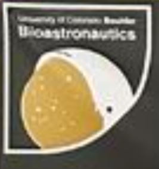

# Realtime Physiology Monotoring Station   Table of Contents
- [Section 1: Introduction and Learning Resources](#section-1-introduction-and-learning-resources)
  - [1.a — Welcome to the Project](#1a--welcome-to-the-project)
  - [1.b — Current Abilities of the Program and Recommendations for Use Cases](#1b--current-abilities-of-the-program-and-recommendations-for-use-cases)
  - [1.c — Learning and Resources](#1c--learning-and-resources)
- [Section 2: Set Up and Development](#section-2-set-up-and-development)
  - [2.a — Step-by-Step Setup for Windows](#2a--step-by-step-setup-for-windows)
  - [2.b — Development Functions: Incoming Data](#2b--development-functions-incoming-data)
  - [2.c — Development Functions: Data Analysis](#2c--development-functions-data-analysis)
---

## Section 1: Introduction and Learning Resources

---

### 1.a — Welcome to the Project

Lorem ipsum dolor sit amet, consectetur adipiscing elit. Sed do eiusmod tempor incididunt ut labore et dolore magna aliqua. Ut enim ad minim veniam, quis nostrud exercitation ullamco laboris nisi ut aliquip ex ea commodo consequat. Duis aute irure dolor in reprehenderit in voluptate velit esse cillum dolore eu fugiat nulla pariatur.

 

  

 

  

 

  

---

### 1.b — Current Abilities of the Program and Recommendations for Use Cases

Lorem ipsum dolor sit amet, consectetur adipiscing elit. Ut enim ad minim veniam, quis nostrud exercitation ullamco laboris nisi ut aliquip ex ea commodo consequat. Duis aute irure dolor in reprehenderit in voluptate velit esse cillum dolore eu fugiat nulla pariatur. Excepteur sint occaecat cupidatat non proident, sunt in culpa qui officia deserunt mollit anim id est laborum.

Sed ut perspiciatis unde omnis iste natus error sit voluptatem accusantium doloremque laudantium, totam rem aperiam, eaque ipsa quae ab illo inventore veritatis et quasi architecto beatae vitae dicta sunt explicabo. Nemo enim ipsam voluptatem quia voluptas sit aspernatur aut odit aut fugit, sed quia consequuntur magni dolores eos qui ratione voluptatem sequi nesciunt.

---

### 1.c — Learning and Resources

Lorem ipsum dolor sit amet, consectetur adipiscing elit. Sed do eiusmod tempor incididunt ut labore et dolore magna aliqua. Ut enim ad minim veniam, quis nostrud exercitation ullamco laboris nisi ut aliquip ex ea commodo consequat. The table below organises key learning resources by subject area and experience level — use it to find materials appropriate to your current familiarity with each topic.

| Resource Level | Biopac | Multi-Processing | Python |
|----------------|--------|-----------------|--------|
| **Beginner**   | Lorem ipsum dolor sit amet | Consectetur adipiscing elit | Sed do eiusmod tempor |
| **Intermediate**| Ut enim ad minim veniam | Quis nostrud exercitation | Ullamco laboris nisi |
| **Advanced**   | Duis aute irure dolor | Reprehenderit in voluptate | Velit esse cillum dolore |

---

## Section 2: Set Up and Development

---

### 2.a — Step-by-Step Setup for Windows

Lorem ipsum dolor sit amet, consectetur adipiscing elit. Sed do eiusmod tempor incididunt ut labore et dolore magna aliqua. Follow the steps below in order to download and configure the system on a Windows machine. Ut enim ad minim veniam, quis nostrud exercitation ullamco laboris nisi ut aliquip ex ea commodo consequat.

---

**Step 1 — [Step Title]**

Lorem ipsum dolor sit amet, consectetur adipiscing elit. Sed do eiusmod tempor incididunt ut labore et dolore magna aliqua. Ut enim ad minim veniam, quis nostrud exercitation ullamco laboris nisi ut aliquip ex ea commodo consequat.

  

---

**Step 2 — [Step Title]**

Lorem ipsum dolor sit amet, consectetur adipiscing elit. Duis aute irure dolor in reprehenderit in voluptate velit esse cillum dolore eu fugiat nulla pariatur. Excepteur sint occaecat cupidatat non proident, sunt in culpa qui officia deserunt mollit anim id est laborum.

  

---

**Step 3 — [Step Title]**

Sed ut perspiciatis unde omnis iste natus error sit voluptatem accusantium doloremque laudantium, totam rem aperiam. Eaque ipsa quae ab illo inventore veritatis et quasi architecto beatae vitae dicta sunt explicabo. Nemo enim ipsam voluptatem quia voluptas sit aspernatur aut odit aut fugit.

  

---

**Step 4 — [Step Title]**

Lorem ipsum dolor sit amet, consectetur adipiscing elit. Ut enim ad minim veniam, quis nostrud exercitation ullamco laboris nisi ut aliquip ex ea commodo consequat. Duis aute irure dolor in reprehenderit in voluptate velit esse cillum dolore eu fugiat nulla pariatur.

  

---

**Step 5 — [Step Title]**

Excepteur sint occaecat cupidatat non proident, sunt in culpa qui officia deserunt mollit anim id est laborum. Sed ut perspiciatis unde omnis iste natus error sit voluptatem accusantium doloremque laudantium. Totam rem aperiam eaque ipsa quae ab illo inventore veritatis et quasi architecto beatae vitae dicta sunt explicabo.

  

---

### 2.b — Development Functions: Incoming Data

Lorem ipsum dolor sit amet, consectetur adipiscing elit. Sed do eiusmod tempor incididunt ut labore et dolore magna aliqua. Ut enim ad minim veniam, quis nostrud exercitation ullamco laboris nisi ut aliquip ex ea commodo consequat. Duis aute irure dolor in reprehenderit in voluptate velit esse cillum dolore eu fugiat nulla pariatur. Excepteur sint occaecat cupidatat non proident, sunt in culpa qui officia deserunt mollit anim id est laborum.

Sed ut perspiciatis unde omnis iste natus error sit voluptatem accusantium doloremque laudantium, totam rem aperiam, eaque ipsa quae ab illo inventore veritatis et quasi architecto beatae vitae dicta sunt explicabo. Nemo enim ipsam voluptatem quia voluptas sit aspernatur aut odit aut fugit, sed quia consequuntur magni dolores eos qui ratione voluptatem sequi nesciunt.

  

At vero eos et accusamus et iusto odio dignissimos ducimus qui blanditiis praesentium voluptatum deleniti atque corrupti quos dolores et quas molestias excepturi sint occaecati cupiditate non provident. Similique sunt in culpa qui officia deserunt mollitia animi, id est laborum et dolorum fuga.

  

Nam libero tempore, cum soluta nobis est eligendi optio cumque nihil impedit quo minus id quod maxime placeat facere possimus, omnis voluptas assumenda est, omnis dolor repellendus. Temporibus autem quibusdam et aut officiis debitis aut rerum necessitatibus saepe eveniet.

---

### 2.c — Development Functions: Data Analysis

Lorem ipsum dolor sit amet, consectetur adipiscing elit. Sed do eiusmod tempor incididunt ut labore et dolore magna aliqua. Ut enim ad minim veniam, quis nostrud exercitation ullamco laboris nisi ut aliquip ex ea commodo consequat. Duis aute irure dolor in reprehenderit in voluptate velit esse cillum dolore eu fugiat nulla pariatur. Excepteur sint occaecat cupidatat non proident, sunt in culpa qui officia deserunt mollit anim id est laborum.

Sed ut perspiciatis unde omnis iste natus error sit voluptatem accusantium doloremque laudantium, totam rem aperiam, eaque ipsa quae ab illo inventore veritatis et quasi architecto beatae vitae dicta sunt explicabo. Nemo enim ipsam voluptatem quia voluptas sit aspernatur aut odit aut fugit, sed quia consequuntur magni dolores eos qui ratione voluptatem sequi nesciunt.

  

At vero eos et accusamus et iusto odio dignissimos ducimus qui blanditiis praesentium voluptatum deleniti atque corrupti quos dolores et quas molestias excepturi sint occaecati cupiditate non provident. Similique sunt in culpa qui officia deserunt mollitia animi, id est laborum et dolorum fuga. Et harum quidem rerum facilis est et expedita distinctio.

  

Nam libero tempore, cum soluta nobis est eligendi optio cumque nihil impedit quo minus id quod maxime placeat facere possimus, omnis voluptas assumenda est, omnis dolor repellendus. Temporibus autem quibusdam et aut officiis debitis aut rerum necessitatibus saepe eveniet ut et voluptates repudiandae sint et molestiae non recusandae.

---
